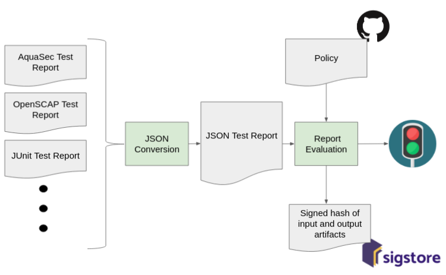

# Red Light Green Light
> A git-centric policy management and enforcement tool designed to accelerate your CI/CD pipelines

[](https://github.com/atgreen/red-light-green-light/actions)
[](https://coveralls.io/github/atgreen/red-light-green-light)

Quick Start
------------

Try out the hosted version at [https://rl.gl](https://rl.gl).  Note
that documents expire after 30 days.

For an example of real-world rlgl policy in action, check out the
policy used to validate unit test reports for
[libffi](https://github.com/libffi/libffi) on
[travis-ci](https://travis-ci.org/libffi/libffi) builds:
[https://github.com/libffi/rlgl-policy](https://github.com/libffi/rlgl-policy).

Download and install one of the cli tools hosted at https://rl.gl.
Now login to the server like so...

    $ rlgl login https://rl.gl

You'll get a message back asking you to create a personal API key.
Follow those instructions, and try again...

    $ rlgl login --key=MY_PERSONAL_KEY https://rl.gl

If you require the use of a proxy, specify like so:

    $ rlgl login --proxy=https://myproxy.example.com:8080 --key=MY_PERSONAL_KEY https://rl.gl

You can also specify a proxy username and password for basic proxy authentication:

    $ rlgl login --proxy=https://myproxy.example.com:8080 \
                 --proxy-auth=USERNAME:PASSWORD \
                 --key=MY_PERSONAL_KEY https://rl.gl

Generate and inspect a player ID, like so...

    $ ID=$(rlgl start)
    $ echo $ID

Generate an OpenSCAP report, or grab one from here:

    $ curl https://raw.githubusercontent.com/atgreen/red-light-green-light/master/test/report.html > report.html

Evaluate the report against a sample policy:

    $ rlgl evaluate --id=$ID --policy=https://github.com/atgreen/test-policy report.htm

To use a private repository, generate a personal access token at
github.com with appropriate private repo access, and reference your
policy repo like so:

    $ rlgl evaluate --id=$ID --policy=https://${TOKEN}@github.com/atgreen/test-policy report.html

Click on the resulting URL and explore.  Try forking the test policy
report and making changes.

Produce a log of reports for this player ID:

    $ rlgl log --id=$ID


Problem Statement
----------------

Modern DevOps pipelines require Quality Gating mechanisms in order to
fully automate the promotion of software artifacts from dev all the
way through to prod. These Quality Gates are responsible for deciding
whether a deployable artifact (config files, software builds,
container images, VM images, etc) should proceed to the next stage of
a CI/CD pipeline.

Many tools are available to evaluate the quality of deployable
artifacts, including container image scanners, unit test harnesses,
config file linters, etc.  But dealing with multiple quality testing
tools introduces problems:

 - bespoke gating mechanisms must be created to evaluate test results
 - different tools require different exception processes and policy management
 - no centralized, auditable policy management
 - policies are locked within proprietary tools


Policy Driven Quality Gates
------------------------------

The main idea behind Red Light Green Light is to decouple the process
of evaluating test results away from the underlying testing tools
themselves, in a way that is:

 - centrally managed
 - version controlled
 - auditable
 - customizeable
 - protected with authentication/authorization mechanisms



The goal of all of this is to enable auditors to easily answer the
following questions as they relate to any artifact promoted through a
CI/CD pipeline:

 - who presented test results for evaluation?
 - what were those test results?
 - what policies were they evaluated against?
 - who defined the policies and when?

The Red Light Green Light service is invoked via the `rlgl`
command-line tool, typically within some other pipeline
automation framework, such as a [jenkins](https://jenkins.io)
pipeline.  Here's an example workflow:

- First, we must log into our Red Light Green Light server with `rlgl`
cli tool like so:
```
$ rlgl login http://rlgl-server.example.com
```

- Each deployable artifact is given a Player ID.  The Player ID is
  what flows down the pipeline along with the various build/deploy
  artifacts.  They would be attached as artifact metadata.

```
$ ID=$(rlgl start)
```

- As the pipeline proceeds, test results are generated (scans, unit
  tests, etc).  For each test report generated, `rlgl` evaluates the
  report against the stated git-hosted policy, resulting in a **Red
  Light**, meaning stop the pipeline, or **Green Light**, meaning
  proceed with the pipeline.  It also produces a URL that links to a
  report showing annotated evaluation results.  Annotations, include,
  for example, the git logs for policies defining exceptions resulting
  in green lights.

```shell
$ rlgl evaluate --policy https://git.example.com/policy/dev.git --id $ID my-test-report.html
GREEN: http://rlgl-server.example.com/doc?id=RLGL-BC7DB3F (sha3/256: 35da0de414ec6eaaa5c758e1b6b364ab7cad20b39bdfce5b15b44570e0f62ef8)
```

```shell
$ rlgl evaluate --policy https://git.example.com/policy/prod.git --id $ID oval-scan.xml
RED: http://rlgl-server.example.com/doc?id=RLGL-1CF5B3A (sha3/256: eb7cad20b64ec6f8758ea4a62e15b439bdfce5b35da0de41aa5c4570e0f1b6b3)
```

```shell
$ rlgl evaluate --policy https://git.example.com/policy/rel.git --id $ID gcc.log
GREEN: http://rlgl-server.example.com/doc?id=RLGL-AFC7DB2 (sha3/256: f8758e1b6b364ab7cad20b39bdfce5b35da0de414ec6eaaa5c4570e0f62e15b4)
```

Standard exit codes make it easy to integrate `rlgl` into your CI/CD
pipeline scripts. `GREEN` lights have an exit code of 0. `RED` lights
have an exit code of 1. Any other exit code is an error. The output
also includes the sha3/256 checksum of the report for future
reference.   You can validate the report with openssl like so...

```shell
$ curl -s https://rlgl-server.example.com/doc?id=RLGL-AFC7DB2 | openssl dgst -sha3-256
(stdin)= f8758e1b6b364ab7cad20b39bdfce5b35da0de414ec6eaaa5c4570e0f62e15b4
```

The report also includes a link to the original document, which is
archived, along with its sha3/256 checksum.

In addition to recording the report for future reference, the Red
Light Green Light server signs the sha3/256 checksum with a private
signing key. The base64-encoded signature is always available via curl
by appending `.sig` to the report URL like so:

```shell
$ curl -s https://rlgl-server.example.com/doc?id=RLGL-AFC7DB2.sig
MGQCMBM/nx+jEdu2RVEwSPCYTqWF/bP/3FlX2FPFRGrRZjOgq/tQj0Eg5XDBO0vC1KLnFwIwVFtMPxsrv3DljSrD422qeA4zqz5JDA/PT3NpM91hI/sehmqJgmkAMQjJB/mkn0xl
```

You can validate this signature against the public signing key like so:

```shell
$ curl -s https://rlgl-server.example.com/doc?id=RLGL-AFC7DB2 | openssl dgst -sha3-256 - | awk '{ printf $2 }' > digest
$ curl -s https://rlgl-server.example.com/doc?id=RLGL-AFC7DB2.sig | base64 -d > digest.sig
$ openssl dgst -sha256 -verify rlgl-public.pem -signature digest.sig digest
Verified OK
```

The Red Light Green Light server also uploads the signed digest to
sigstore for non-repudiation of the results.

The `rlgl` tool can generate a simple shell script to validate
signatures and search for the sigstore log entry.  View the shell
script like so:

```shell
$ rlgl validate RLGL-AFC7DB2
```

You can execute the validation script simply by feeding the output to a shell program:

```shell
$ rlgl validate RLGL-AFC7DB2 | sh
Checking document signature: Verified OK

Searching for sigstore record:
LogID: c0d23d6ad406973f9559f3ba2d1ca01f84147d8ffc5b8445c224f98b9591801d
Index: 5740
IntegratedTime: 2021-07-13T22:06:51Z
UUID: d5cb372f2067cbf2f9eb9edace960ad9ca51994a26d6450d044ed24ceffc204c
Body: {
  "RekordObj": {
    "data": {
      "hash": {
        "algorithm": "sha256",
        "value": "c9693cfbd2c371e30a012e42140e6127171cb25d435d0646c941f190b4a21f7c"
      }
    },
    "signature": {
      "content": "MGQCMBVJyQi5HseSBqyXa8dXQFb6P2h1FHjFesQRPBqDhMik+NfplFG7bt41K5rE8ywyKAIwLtIvwn/DGJSzBTvD7evBMnUzGOHopXtqxUTZhPo2skKaohV69nOPBy+y5YuJzpJb",
      "format": "x509",
      "publicKey": {
        "content": "LS0tLS1CRUdJTiBQVUJMSUMgS0VZLS0tLS0KTUhZd0VBWUhLb1pJemowQ0FRWUZLNEVFQUNJRFlnQUU4ZG8rQVFwbm5tanBwK1J1Y05tTy8zN04xVWpGNzZNZwpXd01Jcm1odlZvTjExajZXL0krSitQdk5NbDZiWHdvQnh0dk53V3dLbzFSdEZ3dGFXMWpWZnNCNEV6SkErb05PCkdEUDlNTmdCQW5uN3JiKzgrTm1XUW1IUllQeEJtbmFJCi0tLS0tRU5EIFBVQkxJQyBLRVktLS0tLQo="
      }
    }
  }
}
```

This gives auditors confidence the server owning the private key
associated with the given public key generated the given report at a
specific time. Since the report references the original test report,
as well as the sha3/256 digest of that original report, we also can be
certain that it is the actual report that was used for the policy
evaluation. And since the report includes the git commit hash of the
policy used to evaluate the report, we can be certain that it is in
fact the version of the policy that was used to generate the report.

That's it!   The client side is very easy.

The server side, where policy is evaluated, is where the magic is.

The first step is to identify the type of report we're evaluating and
convert it into a normalized form.  The normalized form is defined
simply as this: a sequence of JSON objects, one for each testcase
result.  This object has two required fields:

* `result`: whose value is either `PASS` or `FAIL`.
* `id`: a descriptive ID for the testcase (e.g. CVE number).

One optional field is:

* `url`: a URL linking to contextual info for that `id`.

And then as many extra fields may be added to the JSON object as may
be useful below.

Policies are maintained in git repos, and consist of three plain text
files: `XFAIL`, `FAIL`, and `PASS`.  Each of these files contains a
list of JSON matchmaking expressions to match against the canonical
test results.  They are evaluated this order: `XFAIL`, `FAIL`, `PASS`.

`XFAIL` contains matchmakers for test results we are expecting to
fail, but allowing to pass anyway.  These are your exceptions.  Any
matching JSON objects are reported as green, and filtered out from the
list of test results to be processed by `FAIL`.

`FAIL` contains matchmakers for tests results that are definitely
failures.  They are reported as red, and filtered out from the test
results before processing with `PASS`.

`PASS` contains matchers for known test passes and reported as green.

Any remaining entries in the test results are recorded as `UNKNOWN`.
`rlgl` interprets these as red, but they are reported as `UNKNOWN` in
order aim for 100% coverage of the `PASS`/`FAIL` scans.

The `XFAIL`, `FAIL`, `PASS` files are maintained in a git
repo. Changing policy requires modifying the policy in git, which is
logged and auditable.

In addition to this simple test evaluation service, the server can
report on which policies have received green lights for each Player
ID, and records all test documents for archive and audit purposes.
Reports submitted to and generated by Red Light Green Light are
currently archived forever.

```shell
$ rlgl log --id=$ID
Tue, 29 Jan 2019 13:15:29 -0500 Green: 00430cf0324532aab032423 http://rlgl-server.example.com/doc?id=RLGL-AFC7DB2
Tue, 29 Jan 2019 13:16:31 -0500 Green: 10430cf0324532aab032423 http://rlgl-server.example.com/doc?id=RLGL-CFB5DB3
Tue, 29 Jan 2019 13:16:50 -0500 Green: 20430cf0324532aab032423 http://rlgl-server.example.com/doc?id=RLGL-DFC55B6
Tue, 29 Jan 2019 13:16:55 -0500   Red: 30430cf0324532aab032423 http://rlgl-server.example.com/doc?id=RLGL-8FB75B4
```

The format of this log is:

`TIMESTAMP` `RED-OR-GREEN`: `GIT-POLICY-HASH` `REPORT-URL`

Red Light Green Light also has the ability to generate baseline XFAIL
policy in cases where you want to track regressions from an already
imperfect test run.

```shell
$ rlgl baseline RLGL-01234567
```

This command will generate XFAIL policy output to the console for
every FAIL in the report RLGL-01234567 (the "RLGL-" prefix is
optional).


Policy in Detail
---------------

An `rlgl` policy consists of three separate files in a git repo:
`XFAIL`, `FAIL` and `PASS`. Each file contains JSON matchmaking
expressions, comments and blank lines.  Comments are lines starting
with the characters `#` or `;`.  The matchmaking expressions are
single-line JSON objects.

For example, to mark a CVE failure as an exception, we add the
following to our `XFAIL` file:

    # Ignore this failure in our container images
    { "result": "FAIL", "id": "CVE-2014-4043" }

Each JSON field string must match the corresponding string in the test
result object exactly.  There are two special forms of string values.
Strings starting with "^" are interpreted as regular expressions, and
strings of the form "NUMBER..NUMBER" are interpreted as a numeric
range.

So, for example, to ignore all CVE vulnerabilities from 2013 with a
score of less than 7 we add the following to our `XFAIL` file:

    # Ignore everything but the most critical CVEs from 2013.
    { "result": "FAIL", "id": "^CVE-2013.*", "score": "0..6" }

Every element of the matchmaking expression must match the test result
in order to qualify as a match.

A matchmaking expression may be followed by an expiration date, a time
after which the matchmaker no longer applies.

    # Whitelist this failure until April 1, 2019 and 9am
    { "result": "FAIL", "id": "CVE-2014-4043" } 2019-04-01 9:00

The date expiration time can be in any of the following formats:
RFC822 (RFC1123, RFC2822, RFC5322), asctime, RFC850 (RFC1036), ISO8601
(1988, 2000, 2004, except for no-year format), W3CDTF (subset of ISO
8601), RFC3339.  Examples of these include:

* `Thu, 23 Jul 2013 19:42:23 GMT` (RFC1123),
* `Thu Jul 23 19:42:23 2013` (asctime),
* `Thursday, 23-Jul-13 19:42:23 GMT` (RFC1036),
* `2013-07-23T19:42:23Z` (RFC3339),
* `20130723T194223Z` (ISO8601:2004), etc.

Red Light Green Light will also do it's best to interpret variations
of said standards, as in the example above (`2019-04-01 9:00`).

If a date is provided but no time, then it is interpreted as just after
midnight at the start of the day.

JSON matchmaking expressions cannot span more than one line of text.
This is required in order to attribute policy changes to individuals
via `git blame`.  These changelogs are available through the `rlgl`
reports generated at evaluation time.

Report Parsers
---------------

Currently supported report parsers include:

* [Anchore](https://anchore.com) container vulnerability json reports
* [AquaSec](https://github.com/aquasecurity/microscanner) container microscanner reports
* [Clair](https://github.com/coreos/clair) container scanner json reports
* [DejaGnu](https://www.gnu.org/software/dejagnu/) testing framework
* [JUnit](https://junit.org/junit5/) XML results report
* [OpenSCAP](https://www.open-scap.org/) OVAL scan reports
* [OpenSCAP](https://www.open-scap.org/) XCCDF scan reports
* [Tripwire](https://www.tripwire.com/) host scan reports in PDF format
* Comma separated values (CSV) for generic policy enforcement on arbitrary metrics (file size, performance results, etc).

Note that for the CSV parser, the first line of the CSV file defines
the field strings used in the resulting JSON results objects.  For
example, this CSV file...

    filename, filesize
    a.out, 1234567
    b.out, 87908

..produces the following JSON results objects...

    { "filename": "a.out", "filesize": "1234567" }
    { "filename": "b.out", "filesize": "87908" }

..for you to write policy against...

    { "filesize": "0..1000000" }

While the `rlgl` command-line tool is written in
[Go](https://golang.org/), the server side is written in [Common
Lisp](https://github.com/container-lisp), and adding additional report
types requires modifying the `rlgl-server` lisp code.  External parser
support is planned, allowing you to invoke report parsers through a
simple API.

Monitoring & Observability
--------------------------

The Red Light Green Light server exports Prometheus metrics on port 9101.

Red Light Green Light can optionally transmit usage info to a
[Matomo](https://matomo.org) instance.


Configuration
-------------

The Red Light Green Light server is customized through a number of
configuration settings.  Every configuration item is settable through
either environment variables or a [TOML](https://toml.io) formatted
configuration file, `/etc/rlgl/config.ini`. Environment variables
override settings found in the config file.

| Environment Variable               | Config File Setting                | Description                                  |
|------------------------------------|------------------------------------|----------------------------------------------|
| `RLGL_SERVER_URI`                  | `server-uri`                       | URI for the rlgl server                      |
|                                    | `db`                               | Either `sqlite` or `postgresql`              |
|                                    | `sqlite-db-filename`               | File name for sqlite DB                      |
| `POSTGRESQL_PASSWORD`              | `postgresql-password`              | Database password                            |
|                                    | `postgresql-host`                  | Host for postgresql server                   |
|                                    | `postgresql-port`                  | Port for postgresql server                   |
|                                    | `storage-driver`                   | Either `local` or `s3`                       |
|                                    | `local-dir`                        | Local directory for local storage driver     |
|                                    | `policy-dir`                       | Local directory for storing policy git repos |
| `PUBLIC_KEY_FILE`                  | `public-key-file`                  | Public signing key for sigstore records      |
| `PRIVATE_KEY_FILE`                 | `private-key-file`                 | Private signing key for sigstore records     |
| `MATOMO_URI`                       | `matomo-uri`                       | URI for a Matomo sever (optional)            |
| `MATOMO_IDSITE`                    | `matomo-idsite`                    | Site ID for Matomo tracking (optional)       |
| `MATOMO_TOKEN_AUTH`                | `matomo-token-auth`                | Auth token for Matomo tracking (optional)    |
| `KEYCLOAK_OIDC_CLIENT_ID`          | `keycloak-oidc-client-id`          | Keycloak client ID (optional)                |
| `KEYCLOAK_OIDC_CLIENT_SECRET`      | `keycloak-oidc-client-secret`      | Keycloak client secret (optional)            |
| `KEYCLOAK_OIDC_REALM_REDIRECT_URI` | `keycloak-oidc-realm-redirect-uri` | Keycloak realm redirect URI (optional)       |
| `KEYCLOAK_OIDC_REALM_URI`          | `keycloak-oidc-realm-uri`          | Keycloak realm URI (optional)                |
|                                    | `test-api-key`                     | Used for testing                             |
| `AWS_ACCESS_KEY`                   |                                    | Required when using s3 storage               |
| `AWS_SECRET_KEY`                   |                                    | Required when using s3 storage               |

Author and License
-------------------

Red Light Green Light was written by [Anthony
Green](https://github.com/atgreen), and is distributed under the terms
of the GNU Affero General Public License, Version 3.  See
[COPYING](https://raw.githubusercontent.com/atgreen/red-light-green-light/master/COPYING)
for details.
